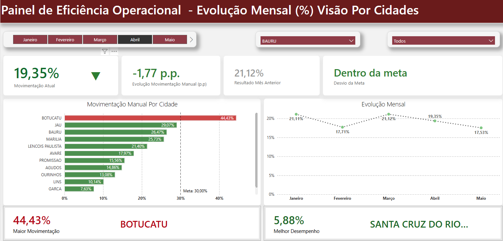
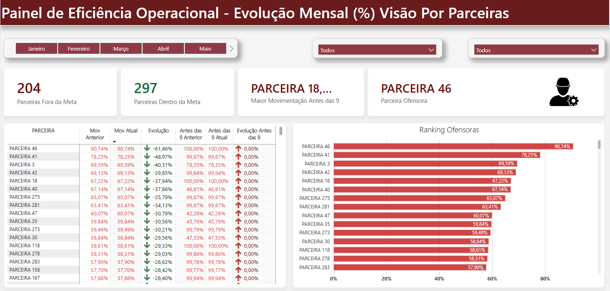
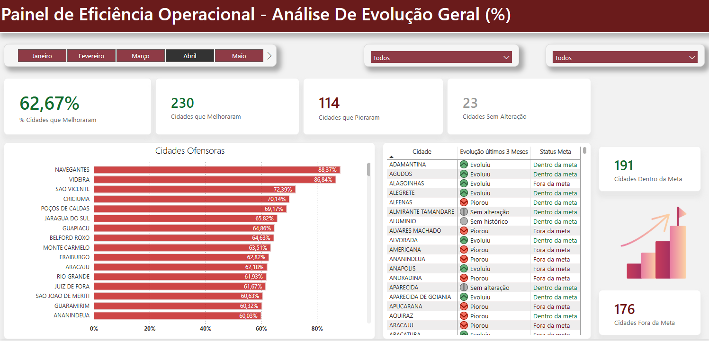

# 🚚 Dashboard – Eficiência Operacional

## 🎯 Objetivo
Dashboard desenvolvido em Power BI para acompanhamento da eficiência operacional, com foco no indicador de Movimentação Manual na rota dos técnicos, permitindo a análise do desempenho da ferramenta de alocação e da evolução mensal dos indicadores.

## ❓ Perguntas que o dashboard responde
- A operação está dentro da meta?
- Houve melhora ou piora em relação ao mês anterior?
- Quais clusters, cidades ou parceiras demandam atenção?
- Onde priorizar ações corretivas?

## 📊 Principais indicadores
- Movimentação Manual (%)
- Evolução Movimentação Manual (pontos percentuais)
- Movimentação Manual antes das 9h
- Parceiras dentro e fora da meta

## 🧠 Destaques técnicos
- Comparação mês atual x mês anterior em pontos percentuais (p.p.)
- Medidas DAX com leitura executiva
- Formatação condicional com semáforo
- Título dinâmico por filtros
- Layout preparado para print e e-mail.  

## 🖼️ Visual do Dashboard

### 📊 Visão Executiva – Indicadores Consolidados

Leitura executiva do desempenho operacional, com foco nos principais KPIs, status da meta e evolução mensal.

---

### 🔎 Visão Analítica – Detalhamento por Parceiras

Análise detalhada das parceiras ofensoras, apoiando a priorização de ações corretivas.

---

### 📈 Visão Estratégica – Evolução Geral

Análise da evolução dos indicadores ao longo do tempo, permitindo acompanhamento estratégico e identificação de tendências.

> **Observação:** este é um projeto real, desenvolvido no contexto das atividades do dia a dia. Para fins de compartilhamento e portfólio, os dados apresentados foram anonimizados e/ou substituídos por dados fictícios, preservando a lógica de negócio, a modelagem e as análises, sem expor informações sensíveis ou corporativas.
